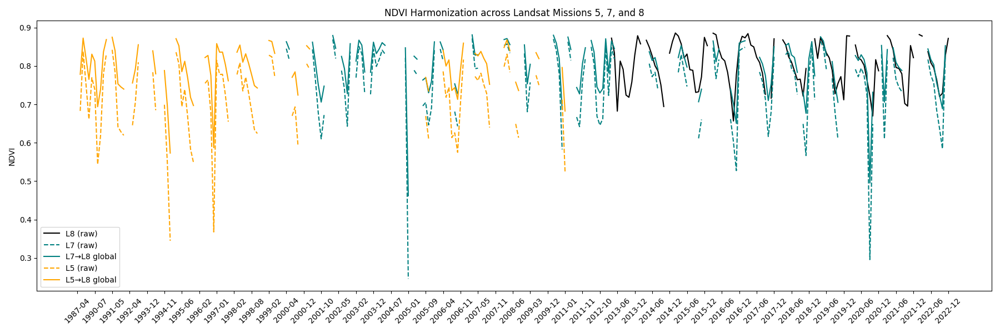

# pixltsnorm Documentation

**Pixel-based Linear Time Series Normalizer**



## Overview

**pixltsnorm** is a lightweight Python library for bridging and **harmonizing** multi-sensor time-series data (e.g., NDVI, reflectance). It supports:

- **Linear transformations** (y = slope*x + intercept) to match one sensor's scale onto another.
- **Chain bridging** across multiple sensors (sensor0 → sensor1 → sensor2 → ...).
- **Optional Earth Engine** submodules for GEE-based reflectance processing.
- **Optional Seasonal Decomposition** (for exactly two sensors):  
  Remove a seasonal signal from each sensor’s time series, fit a linear regression on the de-seasonalized data, then re-apply the seasonal component of the target sensor to get a final transform.  

Use pixltsnorm to standardize multi-sensor time-series from, say, Landsat 5, 7, and 8, or unify data from any domain that needs a simple linear or seasonal-based scale alignment.

## Features

1. **Outlier Filtering**  
   Use threshold-based filtering (|A - B| > threshold) before performing regression.

2. **Local Bridging**  
   Fit transformations on a **per-pixel** basis (row-by-row), so each spatial location can have its own slope/intercept.

3. **Global Bridging**  
   Perform a dataset-wide slope/intercept regression, combining all overlapping pixel/time pairs.

4. **Chaining**  
   Link pairs of sensors (e.g., L5 → L7, L7 → L8) and produce a final transform for each sensor onto the target’s scale.

5. **Seasonal Decomposition (2-sensor only)**  
   For time-series with strong periodic signals, you can de-seasonalize both sensors, fit a linear model on the residuals, then reintroduce the target sensor's seasonal pattern.

## Example Notebooks

We provide sample Jupyter notebooks to help you get started:

- **[Quick Start: Timeseries Harmonization](examples/global-ndvi-harmonization.ipynb)**
- **[Global NDVI Harmonization](examples/global-ndvi-harmonization.ipynb)**
- **[Local (per-pixel) NDVI Harmonization](examples/local-ndvi-harmonization.ipynb)**
- **[Creating NDVI Timeseries with Earth Engine](examples/create-ndvi-timeseries-with-earthengine.ipynb)**

To run these notebooks:
```
pip install jupyter
```

## Installation

To install from PyPI:
```
pip install pixltsnorm
```

Or install locally from source:
```
git clone https://github.com/iosefa/PyForestScan.git
cd PyForestScan
pip install .
```

## References

This library is inspired by techniques described in:

Roy, D. P., Kovalskyy, V., Zhang, H. K., Vermote, E., Yan, L., Kumar, S. S., & Egorov, A. (2016). Characterization of Landsat-7 to Landsat-8 reflective wavelength and normalized difference vegetation index continuity. *Remote Sensing of Environment, 185*, 57–70.
